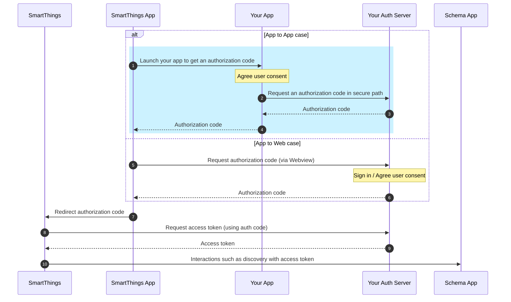

# Phase 1: Environment Setup

Establish secure domain-to-app associations for Android App Links and iOS Universal Links.

---

## 💡 Concept Overview: App Links & Universal Links

> [!IMPORTANT]
> **Key Integration Rules**:
> *   **ST-Schema Only**: App-to-App Account Linking is supported **exclusively** for Cloud Connected (ST-Schema) integrations.
> *   **Browser Fallback**: If the partner application is not installed on the user's mobile device, the SmartThings App automatically falls back to standard web browser-based OAuth.

*   **Definition**: OS-level features (Android App Links / iOS Universal Links) that open your native app directly when a web URL (HTTP/HTTPS) is clicked, skipping browser selection popups.
*   **Why use them instead of custom URI schemes (e.g., `myapp://`)?**:
    1.  **Security**: The OS verifies domain ownership via `assetlinks.json`/AASA to prevent malicious apps from hijacking your links.
    2.  **Smooth Fallback**: If the app is not installed, the OS cleanly opens the website in Safari/Chrome instead of failing.

### Account Linking Flows

The diagram below outlines the overall OAuth authorization and token exchange process, highlighting the secure App-to-App flow (shaded in blue) and the traditional App-to-Web fallback:

---

> [!IMPORTANT]
> **Domain Ownership `{your-domain}`**:
> All occurrences of `{your-domain}` (or `yourdomain.com`) in the paths and console registration parameters refer to the developer's **own verified server domain** (e.g., `yourcompany.com`).
> * **Ownership**: Must be fully owned and controlled by your organization.
> * **Security**: Must support SSL/TLS over HTTPS (HTTP is not permitted by mobile operating systems).
> * **Consistency**: The domain and path prefix must match exactly across the console settings, mobile source codes, and hosted digital asset files.

## 🤖 Android App Links Setup

*   **File Target**: `https://{your-domain}/.well-known/assetlinks.json`
*   **Requirements**: Serve over HTTPS, response Content-Type `application/json`, HTTP `200 OK` status, and no redirects.
*   **Source of Truth**: Refer to the **Account Linking on Android > Prerequisites** section of the [Official App-to-App Documentation](https://developer.smartthings.com/docs/devices/cloud-connected/app-to-app-linking#prerequisites) for the verified JSON payload structure, Play Console signing key details, and relation attributes.

---

## 🍏 iOS Universal Links Setup

*   **File Target**: `https://{your-domain}/.well-known/apple-app-site-association` (no extension)
*   **Requirements**: Serve over HTTPS, response Content-Type `application/json`, HTTP `200 OK` status, and no redirects.
*   **Source of Truth**: Refer to the **Account Linking on iOS > Prerequisites** section of the [Official App-to-App Documentation](https://developer.smartthings.com/docs/devices/cloud-connected/app-to-app-linking#prerequisites-1) to retrieve the required `apple-app-site-association` JSON schema, App ID formatting (`TeamID.BundleID`), and components mapping.

---

## 🔑 Preparation Checklist (Domain Files & Console)

| OS | Parameter | Purpose / Target Destination |
| :--- | :--- | :--- |
| **Android** | Package Name | Defined in `assetlinks.json` on your server (`applicationId` in `build.gradle`) |
| | SHA-256 Fingerprint | Defined in `assetlinks.json` on your server (from app signing key) |
| | Android App-to-App Link | Entered in SmartThings Console (e.g., `https://yourdomain.com/smartthings-auth`) |
| **iOS** | Bundle ID | Defined in `apple-app-site-association` (AASA) on your server |
| | Team ID | Defined in `apple-app-site-association` (AASA) on your server (10-char Apple Team ID) |
| | iOS App-to-App Link | Entered in SmartThings Console (e.g., `https://yourdomain.com/smartthings-auth`) |
| | App Store ID | (Optional) Entered in SmartThings Console for App Store redirection |

---

## 🛠️ File Generation Support

The AI assistant can automatically generate domain association files directly in your workspace. Provide the following parameters to request generation:
*   **Android (`assetlinks.json`)**: Package Name & SHA-256 fingerprint.
*   **iOS (`apple-app-site-association`)**: App Bundle ID & Apple Developer Team ID.

> [!IMPORTANT]
> **Preserving Existing Domain Associations (Merge Rule)**:
> If you already have existing domain verification files, the AI assistant must **not** overwrite them. It will read the existing JSON contents and **merge** the new SmartThings credentials into the existing arrays/dictionaries, ensuring that existing configurations (e.g. Google Login, Apple Sign In, or other custom App Links) remain functional.
