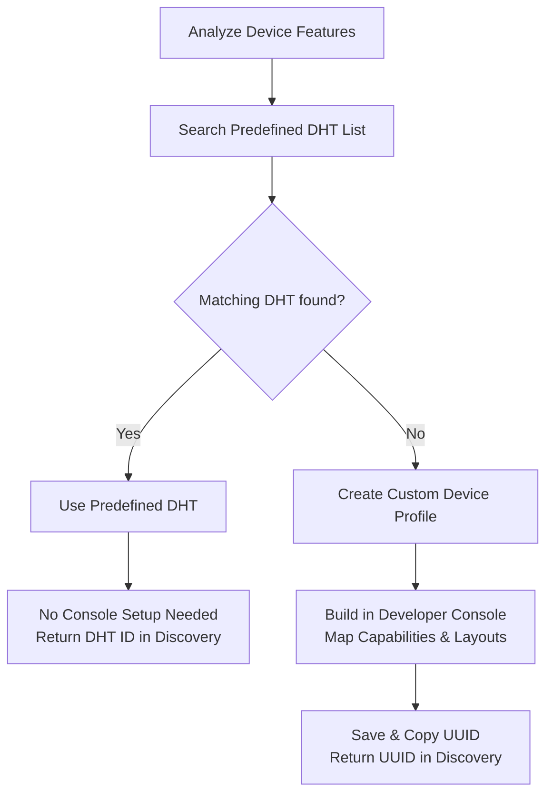

# Cloud-Connected Device Profiles Guide

When connecting a Cloud-Connected (ST-Schema) IoT device to SmartThings, you must define **how the device will appear to the user** (UI/UX layout, card icon) and **what specific features (Capabilities) will be integrated**.

To implement this, you can choose between two methods:
1. **Device Handler Types (DHT)**: Predefined, standard platform templates.
2. **Custom Device Profiles**: Bespoke profiles custom-built via the Developer Console.

This guide provides a concise reference to help you make this optimal architectural choice, construct custom profiles, and systematically validate capabilities.

---

## 🗺️ DHT vs. Custom Device Profile Decision Framework

When integrating your device, choosing between DHT and Custom Device Profiles determines how the interface and capabilities are mapped.



### 📊 Comparative Quick View

| Feature | Device Handler Types (DHT) | Custom Device Profiles |
| :--- | :--- | :--- |
| **Concept** | Pre-built standard platform templates. | Bespoke developer-defined UI & capabilities. |
| **Setup Cost** | **Zero**. Reference a predefined string. | **Moderate**. Register & design in Developer Console. |
| **Capability Limit**| Single/Simple standard features. | Multi-component & complex features. |

### 📝 Decision Checklist
*   **Choose DHT if:** Device strictly matches standard types (e.g. simple switch, dimmer, rgb bulb), fast deployment is critical, and custom layouts are unnecessary.
*   **Choose Custom Device Profile if:** No matching DHT exists, the device has multiple sensors/controls (e.g. multi-sensor), requires custom attributes/ranges, or needs a specific dashboard layout.

---

## 🛠️ Step-by-Step Profile Creation (Console Web UI)

1. **Log in and Select Organization**: Go to [SmartThings Developer Console](https://developer.smartthings.com/console/integrations) and select your target **Organization** from the top-right profile selector.
2. **Navigate to Device Profiles**: Select the **`Device Profiles`** tab from the main screen's top navigation bar.
3. **Start Profile Creation**: Click the **`Create`** button on the right side.
4. **Configure Basic Profile Info**:
   - **Profile Name**: Enter a descriptive name (e.g., `Lumos Smart Color Bulb`).
   - **Category & Icon**: Select the appropriate device category (e.g., `Light`) to bind the corresponding mobile app icon.
5. **Map Capabilities**:
   - Search and add standard Capabilities from the right panel.
   > [!IMPORTANT]
   > **Mandate for WWST Certification**
   > Custom Device Profiles **must** include **`healthCheck`** (to prevent a permanent "Checking status..." error). Most devices with readable attributes should also include **`refresh`** (to enable the pull-to-refresh action). Stateless devices without readable attributes may omit it. (Note: When sending states via Schema payload, these are prefixed with the namespace, e.g., `st.healthCheck`).
6. **Configure Dashboard Layout**:
   - **Dashboard State**: Select the component and capability to represent the device's status on the dashboard card (e.g., `main → Temperature Measurement` or `main → Switch`).
   - **Dashboard Action**: Select the component and capability for the quick action control on the dashboard card (e.g., `main → Switch`).
7. **Save and Copy UUID**: Click **`Save`** to complete the profile creation, and copy the generated **Device Profile ID (UUID)** to use in your SDK's Discovery response.
8. **(Highly Recommended) Verify & Review via CLI**:
   - Before implementing discovery or handler code, retrieve and audit the live profile structure registered in the platform using the CLI to ensure no components or capabilities (especially mandatory ones) are missing or misconfigured.
   - Run the following command in your terminal:
     ```bash
     # Fetch the registered profile details in JSON format
     smartthings deviceprofiles <device-profile-uuid> -j
     ```
   - **Verification Checklist**:
     - Check if the `components` list and their IDs (e.g., `main`) align perfectly with your hardware spec and planned code logic.
     - Ensure **`healthCheck`** (and **`refresh`** if applicable) are explicitly present inside the capabilities list.
     - Validate that dashboard state and action mappings point to the correct active attributes.

---

## 📋 Standard Mappings & Recommended Capabilities

### Standard DHT Mapping (No Console Setup Needed)
Return the exact **Handler ID** as the `deviceHandlerType` in your Discovery payload:

| Category | Physical Capabilities | Required Capabilities | Standard DHT ID |
| :--- | :--- | :--- | :--- |
| **Switch** | On/Off Switch | `st.switch` | `c2c-switch` |
| **Dimmer** | On/Off + Brightness | `st.switch`, `st.switchLevel` | `c2c-dimmer` |
| **RGB Bulb** | On/Off + Brightness + RGB Color | `st.switch`, `st.switchLevel`, `st.colorControl` | `c2c-rgb-color-bulb` |
| **RGBW Bulb** | On/Off + Brightness + RGB + Color Temp | `st.switch`, `st.switchLevel`, `st.colorControl`, `st.colorTemperature` | `c2c-rgbw-color-bulb` |
| **Motion** | Motion + Battery | `st.motionSensor`, `st.battery` | `c2c-motion-2` |
| **Contact** | Open/Close + Battery | `st.contactSensor`, `st.battery` | `c2c-contact-3` |

### Recommended Custom Profile Capabilities
Ensure you append **`healthCheck`** to all Custom Device Profiles (and **`refresh`** if the device has readable attributes). Note that these use standard IDs without the `st.` prefix in the Developer Console:

*   **Multi-Color Light**: `switch`, `switchLevel`, `colorControl`, `colorTemperature`
*   **Thermostat**: `temperatureMeasurement`, `thermostatMode`, `thermostatCoolingSetpoint`, `thermostatHeatingSetpoint`, `thermostatOperatingState`
*   **Environmental Sensor**: `temperatureMeasurement`, `relativeHumidityMeasurement`, `motionSensor`, `battery`

---

## 🔍 Capability Usability & Validation

Ensure capabilities are valid and supported to pass WWST certification.

### 📌 3-Step Selection Workflow
1. **Physical Feature Mapping**: Translate spec sheet controls into actuators and sensors.
2. **Search Standard Capabilities**: Find matching standard capability IDs in SmartThings.
3. **CLI Real-Time Validation**: Inspect schemas and status using the CLI.

### 💻 Essential CLI Commands
Run these in your terminal to inspect capabilities before coding or building profiles:
```bash
# List all standard capabilities to verify existence
smartthings capabilities -s

# Get schema and details for a specific capability (e.g., switchLevel v1)
smartthings capabilities switchLevel 1 -j
```

### 🛡️ WWST Usability Checklist
*   [ ] **Namespace Verification (Standard Only)**:
    *   *Rule*: Use pure standard IDs (e.g., `switch`, `switchLevel`).
    *   *Violation*: Custom namespace capabilities (e.g., `companyabc.customLight`) will fail standard WWST pipelines.
*   [ ] **Status Inspection (Live / Proposed)**:
    *   *Live/Active* 🟢: Safe for production and WWST.
    *   *Proposed* 🟡: Active development. **Can be considered and used at the same level as Live** (verification during actual integration is recommended).
    *   *Deprecated/Dead* 🔴: **Never use.** Automatically fails WWST certification.
*   [ ] **Data & Command Alignment**:
    *   Verify value types (e.g., mapping a physical 0.0-1.0 range to `switchLevel`'s 0-100 integer range using a code mapper).
    *   Ensure physical commands match capability schema commands.

> [!WARNING]
> **Anti-Hallucination Rule**: Never invent or use custom namespaces (e.g., `st.myCustomDimmer`) in your Discovery code or Console profiles.